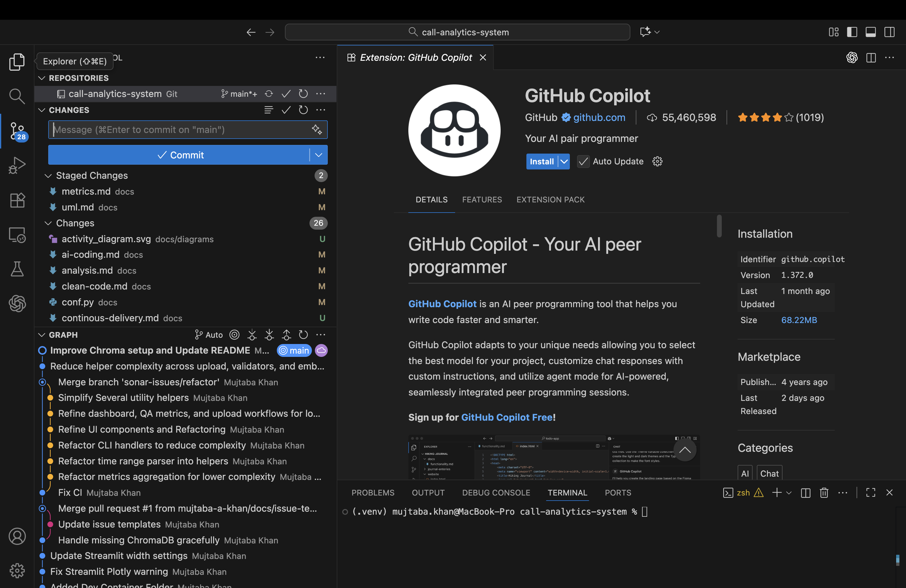

# AI-Assisted Coding

Guidelines for using AI tools like OpenAI Codex, Github Co-pilot in this project.

## Table of Contents

- [Overview](#overview)
- [GitHub Copilot Setup Snapshots](#github-copilot-setup-snapshots)
- [AI Tools Used](#ai-tools-used)
- [Best Practices](#best-practices)
- [AI-Assisted Development Workflow](#ai-assisted-development-workflow)
- [Code Review Guidelines](#code-review-guidelines)
- [Prompt Engineering](#prompt-engineering)
- [Common Patterns from Repository](#common-patterns-from-repository)
- [Quality Assurance](#quality-assurance)
- [Limitations and Risks](#limitations-and-risks)
- [Case Studies from Repository](#case-studies-from-repository)
- [References](#references)

## Overview

### Purpose

This doc is based on the experiences of use of AI tools in this project.

## GitHub Copilot Setup Snapshots



The first thing I did was open the VS Code marketplace and double-check the Copilot listing and made installation for both extentions including Copilot chat


Right after installation, I used the command palette to confirm the new Copilot entries were registered. From here I could jump straight into the agent workspace.


Before sending any prompts, I tuned the available tools in Copilot chat. Disabling features I didn’t need and picking Claude Sonnet as a baseline gave me a fair comparison for Copilot’s output. It also highlighted how granular the access controls are.


My first prompt was a systems-level request: audit the repo for DSL patterns. Framing the question in first person clarified my expectations, and Copilot recognized that the Jenkinsfile and DSL-centric modules were the right places to inspect.


When Copilot started streaming results, it cited files under `src/` and gave inline reasoning. It stayed local, respecting the instruction to avoid external fetches—and it produced a navigable list for my review.


The final response grouped the DSL characteristics (regex matching, TOML-driven configs, natural-language parsing) into a single summary.

## AI Tools Used

### Goals

1. **Speed up development** - Write code faster with AI help
2. **Keep quality high** - Make sure AI code meets our standards
3. **Learn together** - Use AI to help the team learn
4. **Stay consistent** - Use AI the same way across the project
5. **Reduce risks** - Catch security and quality issues early

### Basic Rules

- **You're in charge** - Codex suggests, you decide
- **Always check** - Never trust Codex code without reviewing it
- **Give context** - More context = better Codex suggestions
- **Start small** - Use Codex output as a starting point, then improve it

### OpenAI Codex

I use Codex for several AI-assisted coding in this project:
- Auto-completing code as you type
- Writing functions from docstrings
- Generating test cases
- Creating boilerplate code
- Discussing architecture with agent
- Explaining algorithms
- Getting refactoring ideas
- Help with debugging

Works well for:
- Repetitive patterns
- Standard implementations
- Test structure
- Complex problems
- Design decisions

## Best Practices

### 1. Give Codex Good Context

The more context you provide, the better the Codex suggestions.

```python
# ❌ Bad - No context
def process_data(data):
    # Codex has no idea what to do here
    pass
```

*From: src/utils/formatters.py, lines 22-36*
```python
# ✅ Good - Clear context 
def format_phone_number(phone: str, country_code: str = "US") -> str:
    """Format a phone number using international notation."""
    try:
        parsed = phonenumbers.parse(phone, country_code)
        return phonenumbers.format_number(
            parsed,
            phonenumbers.PhoneNumberFormat.INTERNATIONAL,
        )
    except phonenumbers.NumberParseException:
        digits = re.sub(r"\D", "", phone)
        if len(digits) == 10:
            return f"+1 ({digits[:3]}) {digits[3:6]}-{digits[6:]}"
        if len(digits) == 11 and digits.startswith("1"):
            return f"+1 ({digits[1:4]}) {digits[4:7]}-{digits[7:]}"
        return phone
```

**What helps Codex understand your code:**
- Type hints
- Docstrings with examples
- Related imports
- Nearby code
- Comments about what you're trying to do

### 2. Security First

Always check Codex-generated code for security issues before using it.

**Things to check:**
- [ ] No hardcoded passwords or API keys
- [ ] Input validation exists
- [ ] SQL injection protection
- [ ] Path traversal protection
- [ ] XSS prevention
- [ ] Using secure random numbers
- [ ] Error messages don't leak info

**Example - Secure File Hashing**:

*From: `src/utils/file_handlers.py`, lines 153-159*

```python
SECURE_HASHERS: dict[str, HashFactory] = {
    "sha256": hashlib.sha256,
    "sha384": hashlib.sha384,
    "sha512": hashlib.sha512,
    "blake2b": hashlib.blake2b,
    "blake2s": hashlib.blake2s,
}
```

This dictionary only allows secure hash algorithms. No MD5 or SHA1 which are weak.

*From: `src/utils/file_handlers.py`, lines 162-183*

```python
def get_file_hash(filepath: str | Path, algorithm: str = "sha256") -> str | None:
    """Calculate the hash of a file using a secure algorithm."""
    filepath = Path(filepath)

    if not filepath.exists():
        return None

    try:
        hasher_factory = SECURE_HASHERS.get(algorithm.lower())
        if hasher_factory is None:
            raise ValueError(f"Unsupported or insecure algorithm: {algorithm}")
        hasher = hasher_factory()

        with open(filepath, "rb") as handle:
            for chunk in iter(lambda: handle.read(4096), b""):
                hasher.update(chunk)

        return hasher.hexdigest()

    except Exception as exc:
        logger.error("Error hashing file %s: %s", filepath, exc)
        return None
```

**Secure Random Numbers**:

*From: `scripts/setup_environment.py`, lines 27-62*

```python
def secure_choice(options: Sequence[Any]) -> Any:
    """Pick a random item securely - for generating sample data."""
    if not options:
        raise ValueError("The options sequence must not be empty.")
    return secrets.choice(options)


def secure_randint(min_value: int, max_value: int) -> int:
    """Generate a random integer securely."""
    if min_value > max_value:
        raise ValueError("min_value must be less than or equal to max_value.")
    return min_value + secrets.randbelow(max_value - min_value + 1)
```

Use `secrets` module for random numbers, not `random` module. The `secrets` module is cryptographically secure.

### 3. Always Test Codex Code

Codex can write code, but you need to write tests for it.

*From: `scripts/download_models.py`, lines 100-151*

```python
class ModelDownloader:
    """Downloads ML models for the call analytics system."""

    def download_file(
        self,
        url: str,
        destination: Path,
        expected_sha256: str | None = None,
    ) -> bool:
        """
        Download a file with progress bar and hash check.

        Returns:
            True if download successful, False otherwise
        """
        # Implementation with error handling...
```

Then write tests:

```python
class TestDownloadFile:
    def test_invalid_url(self):
        """Make sure bad URLs are handled."""
        result = download_file("invalid://url", Path("/tmp/test"))
        assert result is False

    def test_hash_verification(self):
        """Make sure hash checking works."""
        # Test implementation...

    def test_progress_tracking(self):
        """Make sure progress bar works."""
        # Test implementation...
```

### 4. Document When You Use Codex

Let others know when Codex helped write code.

```bash
# Simple case
git commit -m "feat: implement file hash verification

AI-assisted: Initial code from OpenAI Codex
Manual changes: Added secure algorithm validation, error handling"

# Bigger contribution
git commit -m "refactor: optimize batch processing

Co-authored-by: OpenAI Codex
- AI generated parallel processing structure
- Added error recovery manually
- Added tests manually"
```

## Codex-Assisted Development Workflow

### 1. Planning

Use Codex for brainstorming and planning:
- Architecture ideas
- Design patterns
- Tech choices

**Example from our code**:

*From: `scripts/setup_environment.py`, lines 87-110*

```python
class EnvironmentSetup:
    """Handles complete environment setup for the Call Analytics System."""

    # Required Python version
    REQUIRED_PYTHON = (3, 11)

    # Required directories
    REQUIRED_DIRS = [
        "data",
        "data/raw",
        "data/processed",
        "data/vector_db",
        # ... more directories
    ]
```

This shows good organization - requirements are clearly defined at the top.

### 2. Implementation

**Example - Calculating Metrics**:

*From: `src/analysis/aggregations.py`, lines 28-75*

```python
class MetricsCalculator:
    """Calculate various metrics and KPIs from call data."""

    def __init__(self):
        """Initialize the metrics calculator"""
        self.metrics_cache = {}
        logger.info("MetricsCalculator initialized")

    def calculate_basic_metrics(self, df: pd.DataFrame) -> dict[str, Any]:
        """
        Calculate basic call metrics."""

    def calculate_basic_metrics(self, df: pd.DataFrame) -> dict[str, Any]:
        """Calculate basic call metrics."""
        metrics = {}
        
        # Total calls
        metrics["total_calls"] = len(df)
        
        # Connection rate
        if "outcome" in df.columns:
            connected = df["outcome"].str.lower() == "connected"
            metrics["connection_rate"] = (connected.sum() / len(df) * 100) if len(df) > 0 else 0
            metrics["connected_calls"] = connected.sum()
        
        # Average duration
        if "duration" in df.columns:
            metrics["avg_duration"] = df["duration"].mean()
            metrics["total_duration"] = df["duration"].sum()
            metrics["median_duration"] = df["duration"].median()
        
        return metrics
```

**Good things to notice:**
- Checks if columns exist before using them
- Handles empty DataFrames (division by zero)
- Clear variable names
- Type hints

## Code Review Guidelines

### What to Check in Codex Code

#### 1. Does It Work?

```python
# ❌ Codex might write this (crashes on empty list)
def calculate_average(numbers: list[int]) -> float:
    return sum(numbers) / len(numbers)

# ✅ Fix it like this (from src/analysis/aggregations.py, line 57)
def calculate_average(numbers: list[int]) -> float:
    if not numbers:
        return 0.0
    return sum(numbers) / len(numbers)
```

#### 2. Does It Handle Errors?

**Example - Safe File Writing**:

*From: `src/utils/file_handlers.py`, lines 32-54*

```python
def safe_file_write(
    filepath: str | Path,
    content: str | bytes,
    mode: str = "w",
) -> bool:
    """Safely write to a file using atomic operations."""
    filepath = Path(filepath)
    temp_file = filepath.with_suffix(".tmp")

    try:
        filepath.parent.mkdir(parents=True, exist_ok=True)

        with open(temp_file, mode) as handle:
            handle.write(content)

        temp_file.replace(filepath)
        return True

    except Exception as exc:
        logger.error("Error writing file %s: %s", filepath, exc)
        if temp_file.exists():
            temp_file.unlink()
        return False
```

**Why this is good:**
- Writes to temp file first, then renames (atomic operation)
- Cleans up temp file if something fails
- Logs errors
- Returns True/False so you know if it worked

#### 3. Input Validation

**Example - Validating DataFrames**:

*From: `src/utils/validators.py`, lines 182-252*

```python
def validate_dataframe(
    df: pd.DataFrame,
    required_columns: list[str],
    column_types: dict[str, type] | None = None,
) -> DataFrameValidationResult:
    """Validate DataFrame structure and content."""
    result: DataFrameValidationResult = {
        "valid": True,
        "errors": [],
        "warnings": [],
        "stats": {},
    }

    # Check if DataFrame is empty
    if df.empty:
        result["valid"] = False
        result["errors"].append("DataFrame is empty")
        return result

    # Check required columns
    missing_columns = set(required_columns) - set(df.columns)
    if missing_columns:
        result["valid"] = False
        result["errors"].append(f"Missing required columns: {missing_columns}")

    # ... more validation
    
    return result
```

This function gives detailed feedback about what's wrong, not just "invalid".

## Prompt Engineering

### How to Write Good Prompts

#### 1. Be Specific

```
❌ Bad: "Write a function to process data"

✅ Good: "Write a Python function that:
- Takes a pandas DataFrame with columns: call_id, duration, category
- Filters calls longer than 5 minutes
- Groups by category
- Returns dict mapping category to average duration
- Include type hints and docstring
- Handle empty DataFrame case"
```

#### 2. Give Context

```
✅ Even Better: "In our call analytics system, write a function to validate
call records before inserting into database.

Context:
- Must validate phone numbers using phonenumbers library
- Duration must be 30-7200 seconds
- Timestamp within last 2 years
- Should return tuple: (is_valid, error_messages)

See src/utils/validators.py for similar validation patterns."
```

## Common Patterns from Repository

### Pattern 1: Lazy Loading

*From: `src/utils/__init__.py`, lines 61-81*

```python
def __getattr__(name: str) -> Any:
    """
    Only import modules when they're actually used.
    This makes startup faster.
    """
    if name in _LOGGER_EXPORTS:
        from . import logger
        return getattr(logger, _LOGGER_EXPORTS[name])

    if name in _VALIDATOR_EXPORTS:
        from . import validators
        return getattr(validators, _VALIDATOR_EXPORTS[name])

    if name in _FORMATTER_EXPORTS:
        from . import formatters
        return getattr(formatters, _FORMATTER_EXPORTS[name])

    raise AttributeError(f"module '{__name__}' has no attribute '{name}'")
```

**Why this helps:**
- Faster imports
- Don't load heavy dependencies until needed
- Uses less memory

### Pattern 2: Structured Logging

*From: `src/utils/logger.py`, lines 21-83*

```python
class StructuredFormatter(logging.Formatter):
    """Output logs as JSON for easier parsing in production."""

    def format(self, record: logging.LogRecord) -> str:
        """Format log record as JSON."""
        log_obj = {
            "timestamp": datetime.now(UTC).isoformat(),
            "level": record.levelname,
            "logger": record.name,
            "message": record.getMessage(),
            "module": record.module,
            "function": record.funcName,
            "line": record.lineno,
        }

        # Add exception info if present
        if record.exc_info:
            log_obj["exception"] = {
                "type": record.exc_info[0].__name__,
                "message": str(record.exc_info[1]),
                "traceback": traceback.format_exception(*record.exc_info),
            }

        return json.dumps(log_obj)
```

### Pattern 3: Config Validation

*From: `src/utils/validators.py`, lines 321-401*

```python
def validate_config(
    config: dict[str, Any],
    schema: dict[str, Any],
) -> ConfigValidationResult:
    """
    Validate configuration and return detailed errors.
    """
    result: ConfigValidationResult = {"valid": True, "errors": [], "warnings": []}

    type_checks: dict[str, tuple[tuple[type, ...], str]] = {
        "string": ((str,), "a string"),
        "int": ((int,), "an integer"),
        "float": ((int, float), "a number"),
        "bool": ((bool,), "a boolean"),
        "list": ((list,), "a list"),
    }

    def mark_error(message: str) -> None:
        result["errors"].append(message)
        result["valid"] = False

    # ... validation logic
    
    return result
```

Returns specific errors instead of just failing silently.

### Pattern 4: Query Parsing

*From: `src/analysis/query_interpreter.py`, lines 75-84*

```python
@dataclass
class QueryIntent:
    """What the user wants to do with their query"""
    action: str  # search, filter, aggregate, compare
    entities: dict[str, list[str]]
    time_range: tuple[datetime, datetime] | None
    filters: dict[str, Any]
    aggregations: list[str]
    confidence: float
```

This dataclass organizes all the query info in one place.

### Pattern 5: Text Similarity

*From: `src/utils/text_processing.py`, lines 453-478*

```python
_SIMILARITY_HANDLERS = {
    "jaccard": _jaccard_similarity,
    "cosine": _cosine_similarity,
    "levenshtein": _levenshtein_similarity,
}


def calculate_similarity(text1: str, text2: str, method: str = "jaccard") -> float:
    """Calculate how similar two texts are."""
    if not text1 or not text2:
        return 0.0

    handler = _SIMILARITY_HANDLERS.get(method)
    if handler is None:
        raise ValueError(f"Unknown similarity method: {method}")
    return handler(text1, text2)
```

Uses a dictionary to pick the right similarity function.

## Quality Assurance

### Running Checks

I always run checks once codex finished it's agentic flow.

```bash

echo "Running quality checks..."

# Type checking
mypy src/ || exit 1

# Linting
ruff check src/ || exit 1

# Formatting
black --check src/ || exit 1

# Security scanning
bandit -r src/ -ll || exit 1

echo "✅ All checks passed!"
```

## Limitations and Risks

### What Codex Gets Wrong

#### 1. Can't See Everything

**Problem**: Codex doesn't know your whole codebase

**Fix**:
- Give it relevant code in prompts
- Use clear names
- Break big tasks into small pieces

#### 2. Makes Stuff Up

**Problem**: Codex generates code that looks right but isn't

**Examples**:

```python
# ❌ Codex might make up methods
df.magic_transform()  # Doesn't exist

# ❌ Wrong imports
from sklearn.nlp import SentimentAnalyzer  # Wrong path

# ❌ Wrong types
def process(data: DataFrame) -> dict:  # Should be pd.DataFrame
    pass
```

**Overcomes**:
- Double check codex generation
- Use Ant building to run ruff, mypy, black together.
- Run the code
- Run the tests.
- Final check with functionality on frontend.

#### 3. Security Issues

**Common problems**:
- SQL injection
- Path traversal
- Hardcoded passwords
- Weak crypto

**Example fix - Filename Safety**:

*From: `src/utils/validators.py`, lines 255-299*

```python
def sanitize_filename(
    filename: str,
    max_length: int = 255,
    replacement: str = "_",
) -> str:
    """Make filename safe for file system."""
    # Remove path separators
    filename = filename.replace("/", replacement).replace("\\", replacement)

    # Remove invalid characters
    invalid_chars = '<>:"|?*'
    for char in invalid_chars:
        filename = filename.replace(char, replacement)

    # Remove control characters
    filename = "".join(char if ord(char) >= 32 else replacement for char in filename)

    # Truncate if too long
    if len(filename) > max_length:
        if "." in filename:
            name, ext = filename.rsplit(".", 1)
            max_name_length = max_length - len(ext) - 1
            filename = name[:max_name_length] + "." + ext
        else:
            filename = filename[:max_length]

    # Ensure not empty
    if not filename:
        filename = "unnamed"

    return filename
```

**PII Protection**:

*From: `src/utils/text_processing.py`, lines 481-506*

```python
def mask_pii(text: str) -> str:
    """Hide personal info in text."""
    if not text:
        return text

    # Hide emails
    text = re.sub(r"\b[A-Za-z0-9._%+-]+@[A-Za-z0-9.-]+\.[A-Z|a-z]{2,}\b", "[EMAIL]", text)

    # Hide phone numbers
    text = re.sub(r"\b\d{3}[-.]?\d{3}[-.]?\d{4}\b", "[PHONE]", text)

    # Hide SSN
    text = re.sub(r"\b\d{3}-\d{2}-\d{4}\b", "[SSN]", text)

    # Hide credit cards
    text = re.sub(r"\b\d{4}[\s-]?\d{4}[\s-]?\d{4}[\s-]?\d{4}\b", "[CREDIT_CARD]", text)

    return text
```

## Case Studies from Repository

### Case Study 1: Environment Setup Script

**File**: `scripts/setup_environment.py`

**What Codex helped with**:
- System dependency detection
- Multi-platform support
- Comprehensive error handling
- Progress reporting

**What I added manually**:
- Secure random number generation for sample data (lines 27-62)
- Complex package manager detection logic
- Detailed logging and user feedback
- Graceful degradation on failures

**Key Lesson**: Codex provided good structure, but human expertise was needed for edge cases and platform-specific quirks.

### Case Study 2: Text Processing Utilities

**File**: `src/utils/text_processing.py`

**Pattern**: Multiple similarity calculation methods

*Reference: lines 453-478* As shown in Pattern 5

**Outcome**:
- Codex generated basic structure
- I added method selection pattern
- Clean, extensible design
- Easy to test individual methods

### Case Study 3: File Operations Safety

**File**: `src/utils/file_handlers.py`

**What Codex provided**: Basic file I/O structure

**What I added**:
- Atomic file operations (lines 32-53): temp file + rename
- Secure hash verification (lines 162-183)
- Comprehensive error handling
- Safe file deletion with optional secure overwrite

**Result**: Production-ready file handling with multiple safety layers

### Case Study 4: Model Download with Verification

**File**: `scripts/download_models.py`

**What Codex helped with**:
- Progress bar implementation
- Streaming download logic
- Model registry structure

**What I added**:
- SHA256 hash verification (lines 157-173)
- Error recovery and retry logic
- Multi-model support (Whisper, Sentence Transformers, Ollama)
- Graceful handling of missing dependencies

*Reference: lines 100-151*

```python
def download_file(
    self,
    url: str,
    destination: Path,
    expected_sha256: str | None = None,
) -> bool:
    """
    Download a file with progress bar and optional hash verification.

    Args:
        url: URL to download from
        destination: Local path to save file
        expected_sha256: Expected SHA256 hash for verification

    Returns:
        True if download successful, False otherwise
    """
    try:
        self.logger.info(f"Downloading {url} to {destination}")

        # Make request
        response = requests.get(url, stream=True)
        response.raise_for_status()

        # Get total file size
        total_size = int(response.headers.get("content-length", 0))

        # Download with progress bar
        with (
            open(destination, "wb") as file,
            tqdm(
                total=total_size,
                unit="B",
                unit_scale=True,
                desc=destination.name,
            ) as pbar,
        ):
            for chunk in response.iter_content(chunk_size=8192):
                file.write(chunk)
                pbar.update(len(chunk))

        # Verify hash if provided
        if expected_sha256:
            self.logger.info("Verifying file hash...")
            if not self.verify_file_hash(destination, expected_sha256):
                self.logger.error("Hash verification failed!")
                destination.unlink()  # Remove corrupted file
                return False

        self.logger.info(f"Successfully downloaded {destination.name}")
        return True

    except Exception as e:
        self.logger.error(f"Failed to download {url}: {e}")
        return False
```

## References

### Code References by Feature

#### Security
- Secure hash algorithms: `src/utils/file_handlers.py`, lines 153-183
- Secure random number generation: `scripts/setup_environment.py`, lines 27-62
- Filename sanitization: `src/utils/validators.py`, lines 255-299
- PII masking: `src/utils/text_processing.py`, lines 481-506

#### Error Handling
- Atomic file operations: `src/utils/file_handlers.py`, lines 32-53
- Safe file reading: `src/utils/file_handlers.py`, lines 57-73
- Config validation: `src/utils/validators.py`, lines 321-401

#### Data Validation
- Phone validation: `src/utils/validators.py`, lines 41-62
- Email validation: `src/utils/validators.py`, lines 27-38
- DataFrame validation: `src/utils/validators.py`, lines 182-252
- Time range validation: `src/utils/validators.py`, lines 427-451

#### Formatting
- Phone number formatting: `src/utils/formatters.py`, lines 22-36
- Duration formatting: `src/utils/formatters.py`, lines 62-106
- Text truncation: `src/utils/text_processing.py`, lines 339-361

#### Logging
- Structured JSON logging: `src/utils/logger.py`, lines 21-83
- Colored console output: `src/utils/logger.py`, lines 85-123
- Performance monitoring: `src/utils/logger.py`, lines 125-151

#### Design Patterns
- Lazy module loading: `src/utils/__init__.py`, lines 61-81
- Handler pattern for similarity: `src/utils/text_processing.py`, lines 453-478
- Query interpretation: `src/analysis/query_interpreter.py`, lines 93-200
- Metrics calculation: `src/analysis/aggregations.py`, lines 28-75

## Conclusion

Use Codex to code faster, but stay in control:

1. **Check everything** - Codex is a helper, not a replacement
2. **Give context** - More info = better code
3. **Security matters** - Always review for issues
4. **Test it** - Codex-generated code needs tests
5. **You decide** - Final call is yours
6. **Learn patterns** - Check out `src/utils/`, `src/analysis/`, `scripts/`