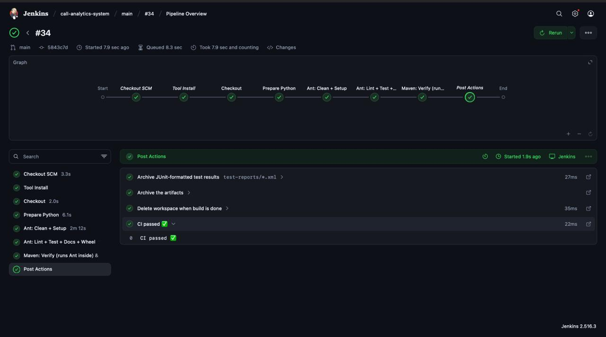
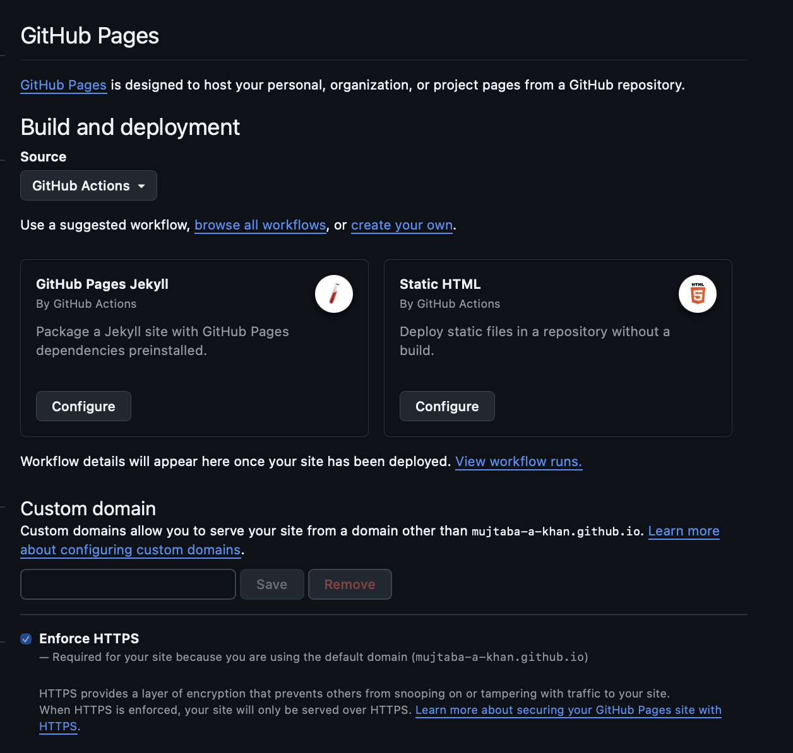
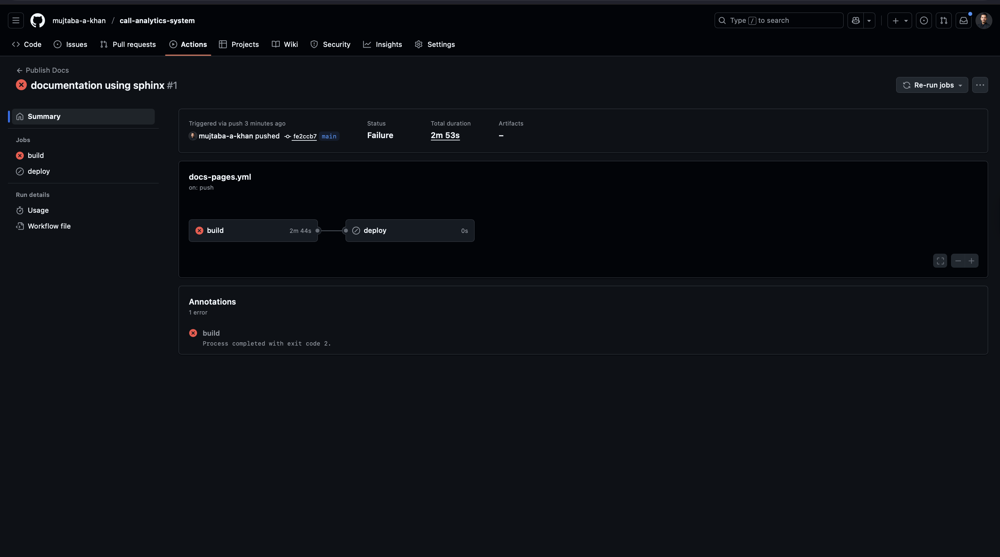
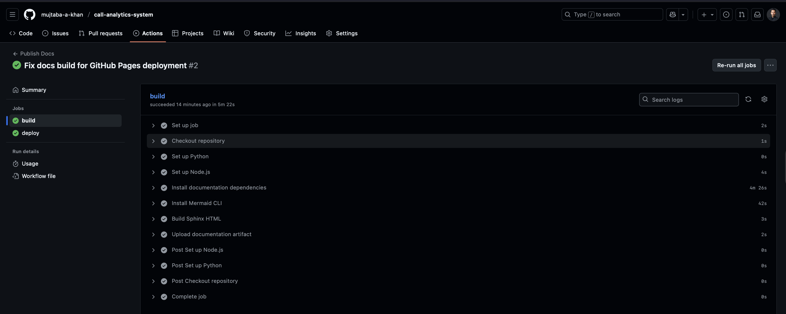

# Continuous Delivery Pipeline

## Table of Contents

- [How I Run CD](#how-i-run-cd)
- [The Tools I Use](#the-tools-i-use)
- [What Each Stage Does](#what-each-stage-does)
- [Downstream Script Calls](#downstream-script-calls)
- [What I Publish](#what-i-publish)
- [How I Rehearse Locally](#how-i-rehearse-locally)
- [Publishing Docs with GitHub Actions](#publishing-docs-with-github-actions)

## How I Run CD

I keep my continuous delivery setup simple by using one Jenkins pipeline script (`Jenkinsfile`). Jenkins pulls my code, prepares the Python toolchain, runs quality checks, builds artifacts, and then stores everything I need for a release. I work with the classic Jenkins interface.

## The Tools I Use

- **Jenkins pipeline** gives me the stage logic and keeps every run repeatable.
- **Apache Ant** (`build.xml`) creates the virtual environment, installs Python dependencies, runs checks, builds docs, and creates a wheel.
- **Apache Maven** (`pom.xml`) wraps the Ant flow during `verify` and then builds a ZIP bundle in `package`.
- **Python virtual environment** keeps my linters, tests, docs, and packaging commands isolated.

## What Each Stage Does

| Stage | What I do | Key commands I call |
| --- | --- | --- |
| `Checkout` | Grab the latest code from source control | `checkout scm` |
| `Prepare Python` | Make sure `python3-venv`, `gcc`, `zip`, and `ensurepip` are present | `sh <<'EOF' ... EOF` to install missing packages |
| `Ant: Clean + Setup` | Wipe old build outputs and create a fresh virtual env | `ant -noinput -buildfile build.xml clean`; `ant ... setup` |
| `Ant: Lint + Test + Docs + Wheel` | Run quality gates, tests, docs, and build the wheel | `ant ... lint`, `ant ... test`, `ant ... docs`, `ant ... wheel` |
| `Maven: Verify (runs Ant inside) & Package ZIP` | Re-run the full Ant flow and bundle the release ZIP | `mvn -B -V -q verify`; `mvn -B -q package` |
| `post` actions | Publish test results, archive artifacts, and wipe the workspace | `junit`, `archiveArtifacts`, `cleanWs` |

Jenkins prints `CI passed ✅` when everything succeeds, and the archived outputs are ready for the next delivery step.


* Jenkins CI/CD Pipeline - All stages passed successfully (Checkout, Tool Install, Prepare Python, Ant tasks, Maven verification, Post Actions)*


## Downstream Script Calls

My pipeline have more than two script calls. Here is the core excerpt from the `Jenkinsfile`:

```groovy
stage('Ant: Clean + Setup') {
  steps {
    sh 'ant -noinput -buildfile build.xml clean'
    sh 'ant -noinput -buildfile build.xml setup'
  }
}
stage('Ant: Lint + Test + Docs + Wheel') {
  steps {
    sh 'ant -noinput -buildfile build.xml lint'
    sh 'ant -noinput -buildfile build.xml test'
    sh 'ant -noinput -buildfile build.xml docs'
    sh 'ant -noinput -buildfile build.xml wheel'
  }
}
stage('Maven: Verify (runs Ant inside) & Package ZIP') {
  steps {
    sh 'mvn -B -V -q verify'
    sh 'mvn -B -q package'
  }
}
```

Every Ant target launches more scripts, like `python -m venv`, `ruff`, `black`, `mypy`, `pytest`, `sphinx-build`, and `python -m build`. So by the time Maven packages the ZIP, the pipeline has touched many different tools.

## What I Publish

1. **Wheels** (`dist/*.whl`) for Python package distribution.
2. **HTML docs** (`docs/_build/html/**`) so I always have the latest documentation.
3. **ZIP bundle** (`artifacts/*.zip`) that I can promote to staging or production.

If I need a follow-up job, Jenkins can pick up the ZIP and run deployment scripts for each environment.

## How I Rehearse Locally

I run the same scripts on my laptop to keep CI and local development in sync:

```bash
# Run the Ant targets exactly like Jenkins
ant -noinput -buildfile build.xml ci

# Let Maven drive Ant and package the ZIP
mvn -B verify package
```

Running these commands before I push gives me confidence that Jenkins will pass and my delivery artifacts are consistent.

## Publishing Docs with GitHub Actions

I also wanted my documentation on GitHub Pages so you can browse the latest guides without cloning the repo. I wired up a lightweight Actions workflow that does three things: install the docs extras, run `sphinx-build -b html docs docs/_build/documentation_v1`, and publish the output with the official Pages deploy action.


* Publish Docs workflow in two stages (`build` and `deploy`)


* The first build got failed and I forget to mention `[docs]` extras (including `linkify-it-py`), add Mermaid CLI for diagrams, and run Sphinx.


* Pages settings – once the workflow succeeds, GitHub Pages reports the live URL where the docs are hosted.

The workflow mirrors the steps I run locally, so if a docs build fails in CI I can reproduce it on my laptop. With this setup, every push to `main` refreshes the hosted documentation automatically.
