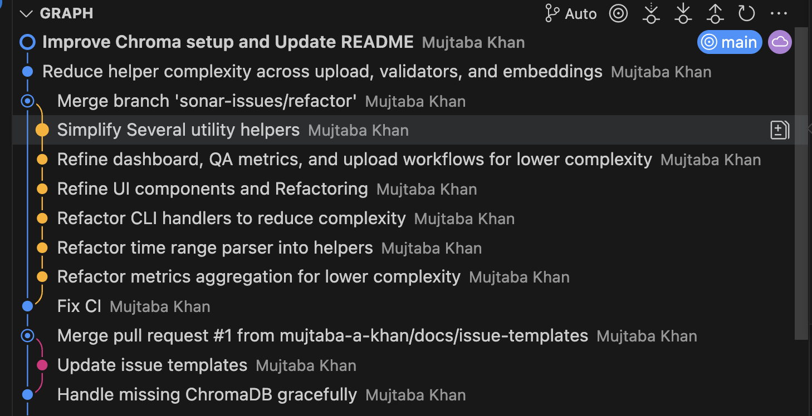

# Git Commands & Git Journal

## Git Cheatsheet

### Creating the feature branch

- Start from `main` and make sure it is up to date:
  - `git checkout main`
  - `git pull origin main`
- Created working branch for refactoring Sonar findings:
  - `git checkout -b sonar-issues/refactor`

### Working locally on `sonar-issues/refactor`

- Check changed files before staging: `git status`
- Stage updates in small chunks: `git add cli.py`
- Commit with a message that describes the refactor: `git commit -m "Refactor CLI handlers to reduce complexity"`
- If I have multiple changes in different files then I do `git add .`

### Syncing with GitHub while on the branch

- Push the branch the first time and set upstream: `git push -u origin sonar-issues/refactor`
- Later pushes are just `git push`
- If someone else touched the branch, pull their commits: `git pull --rebase`

### Switching branches during development

- Jump back to main: `git checkout main`
- List all branches (local + remote): `git branch -a`
- Return to your work branch: `git checkout sonar-issues/refactor`

### Merging back into `main`

- Update `main` before merging:
  - `git checkout main`
  - `git pull origin main`
- Merge in your finished work:
  - `git merge sonar-issues/refactor`
- Push the updated main branch to GitHub: `git push origin main`
- For deleting the feature branch locally and remotely:
  - `git branch -d sonar-issues/refactor`
  - `git push origin --delete sonar-issues/refactor`

### Exploring history and time travelling

- I keep a note of the commit I want to inspect: `git log --oneline | head`
- I jump to that snapshot with `git checkout <commit>` so I can re-run tests against the old code
- When I am done, I return to my branch with `git checkout sonar-issues/refactor`
- If I spot a bug and want Git to undo it for me, I use `git revert <commit>` to add a safe rollback commit
- For quick experiments I create a throwaway branch before time travelling: `git checkout -b debug/<topic>`
- I clean up once I am finished: `git branch -D debug/<topic>`


---

## Purpose

This Git journal documents the complete development history, architectural decisions, and changes in this project. 

### Github Co-Pilot Assisted 
I searched in github co-pilot about how to make git journal so I can have all my commits complined together in one place, commands are mentioned below which was guided by copilot.

### Project Overview

**Repository:** call-analytics-system  
**GitHub:** https://github.com/mujtaba-a-khan/call-analytics-system.git  
**Primary Author:** Mujtaba Khan  
**Project Start:** August 15, 2025  
**Current Status:** Active Development  
**Total Commits:** 84  
**Last Updated:** October 13, 2025 at 10:45 UTC+0200

## Git Evidence Collection

This journal is based on comprehensive Git evidence collected using the following commands:

```bash
# Initial repository clone
git clone https://github.com/mujtaba-a-khan/call-analytics-system.git
cd call-analytics-system

# Fetch all remote references
git fetch --all

# Create evidence directory
mkdir -p docs/evidence

# Compact graph visualization
git --no-pager log --all --oneline --graph --decorate > docs/evidence/git_log_graph.txt

# Full detailed log in CSV-like format
git --no-pager log --all --pretty=format:"%H|%h|%an|%ae|%ad|%ar|%s" --date=iso > docs/evidence/git_log_full.txt

# Reference log (reflog)
git reflog > docs/evidence/git_reflog.txt

# Branch listing and repository status
git branch -a > docs/evidence/git_branches.txt
git status --short > docs/evidence/git_status.txt

# Per-branch logs
mkdir -p docs/evidence/branch_logs
rm -f docs/evidence/branch_logs/*.log
git for-each-ref --format='%(refname:short)' refs/heads refs/remotes |
  sort -u |
  grep -v '/HEAD$' |
  while IFS= read -r ref; do
    [ -z "$ref" ] && continue
    safe=$(printf '%s' "$ref" | tr -cd '[:alnum:]_.-')
    git --no-pager log --pretty=format:"%H|%h|%an|%ae|%ad|%ar|%s" --date=iso "$ref" \
      > "docs/evidence/branch_logs/${safe}.log" 2>/dev/null || true
  done

# Commits as CSV
echo "commit_hash,short_hash,author,email,date,relative_date,subject" > docs/evidence/commits.csv
git --no-pager log --all --pretty=format:'"%H","%h","%an","%ae","%ad","%ar","%s"' --date=iso >> docs/evidence/commits.csv

# Author contribution statistics
git shortlog -sne --all > docs/evidence/author_stats.txt
```

---

## Development Timeline

### Phase 1: Foundation & Core Architecture (Aug 15-18, 2025)

#### Initial Repository Setup

- **Commit:** `3be15ff` - Initial commit (Aug 15, 2025, 23:24 UTC+0200)
  - Established repository structure
  - Set up version control foundation
  - Created project skeleton

#### Component Development

- **Commit:** `a59a660` - UI components infrastructure (Aug 16, 01:14 UTC+0200)

  - Added charts, filters, metrics, and tables components
  - Established modular component architecture
  - Created `__init__.py` structure for ui/components

- **Commit:** `91cd52d` - Documentation foundation (Aug 16, 03:19 UTC+0200)
  - Added comprehensive README
  - Documented project structure and setup instructions
  - Established documentation standards

#### Core Features Implementation

- **Commit:** `e116055` - UI pages foundation (Aug 16, 04:05 UTC+0200)

  - Implemented dashboard, analysis, QA interface, and upload pages
  - Created package initialization for UI modules
  - Established page routing structure

- **Commit:** `d378056` - Automation scripts (Aug 16, 04:19 UTC+0200)

  - Added `download_models.py` for ML model management
  - Implemented `rebuild_index.py` for vector store maintenance
  - Created `setup_environment.py` for system preparation

- **Commit:** `c31aebf` - Utility modules (Aug 16, 04:25 UTC+0200)

  - Added logging infrastructure with `logger.py`
  - Implemented formatters for data presentation
  - Created utility package initialization

- **Commit:** `d3f00f0` - Package initialization (Aug 16, 04:44 UTC+0200)
  - Added `__init__.py` files for ui, core, ml, and vectordb modules
  - Established proper Python package structure
  - Configured module imports

#### Documentation Enhancements

- **Commit:** `74ae261` - README updates (Aug 16, 05:04 UTC+0200)
  - Added formatting utilities documentation
  - Enhanced structure overview with directory tree
  - Improved setup instructions with detailed steps

#### Configuration Management

- **Commit:** `9c7c8ee` - .gitignore configuration (Aug 16, 06:57 UTC+0200)
  - Added project-specific artifacts to ignore list
  - Configured VCS to exclude build artifacts
  - Protected sensitive configuration files

---

### Phase 2: Testing Infrastructure (Aug 16-17, 2025)

#### Test Suite Organization

- **Commit:** `2e51a94` - Package initialization for tests (Aug 16, 08:09 UTC+0200)

  - Added main and analysis package init files
  - Structured test organization by module
  - Established test hierarchy

- **Commit:** `1a4ab95` - Test module creation (Aug 16, 08:35 UTC+0200)

  - Added test_analysis, test_core, and test_ml directories
  - Created initialization packages for test modules
  - Set up test discovery structure

- **Commit:** `1cf2485` - Test package updates (Aug 16, 08:38 UTC+0200)

  - Updated test package initialization
  - Refined test module imports
  - Enhanced test organization

- **Commit:** `434438e` - Test suite restructuring (Aug 17, 05:39 UTC+0200)

  - Restructured tests into module-specific suites
  - Added `conftest.py` for shared fixtures
  - Created test README documentation
  - Removed single test files in favor of organized suites

- **Commit:** `ec080a7` - Test suite privacy (Aug 17, 09:21 UTC+0200)
  - Updated .gitignore to hide test suite internals
  - Protected test implementation details
  - Secured test data

---

### Phase 3: Application Refinement (Aug 18, 2025)

#### Configuration & Dependencies

- **Commit:** `e6090fd` - Package management (Aug 18, 11:49 UTC+0200)

  - Updated init packages across modules
  - Refined `pyproject.toml` configuration
  - Managed project dependencies and metadata

- **Commit:** `53d4172` - CLI addition (Aug 18, 11:53 UTC+0200)
  - Added `cli.py` for command-line interface
  - Updated `app.py` for better CLI integration
  - Enhanced user interaction options

#### Module Organization

- **Commit:** `ecdc4d8` - Module initialization (Aug 18, 11:58 UTC+0200)
  - Updated init packages for src/ml, src/ui, and src/vectordb
  - Improved module organization and imports
  - Standardized package structure

#### Version Control Refinement

- **Commit:** `9247a6c` - .gitignore template update (Aug 18, 12:03 UTC+0200)

  - Enhanced gitignore with comprehensive Python template
  - Added IDE-specific exclusions
  - Improved VCS hygiene

- **Commit:** `6f8873f` - Path resolution fixes (Aug 18, 17:55 UTC+0200)
  - Fixed path-related issues in pages module
  - Updated data parser functionality
  - Resolved import path conflicts

---

### Phase 4: Major Feature Development (Oct 4-5, 2025)

#### Core Functionality Enhancements

- **Commit:** `e80f1a4` - Multi-component updates (Oct 4, 08:37 UTC+0200)

  - LLM integration improvements with better prompting
  - CSV import functionality with robust parsing
  - Upload fixes for file handling
  - QA intent detection enhancements
  - Date parser improvements with multiple formats
  - Sidebar navigation updates
  - Status count implementation
  - README comprehensive updates

- **Commit:** `7dee355` - Data ingestion overhaul (Oct 4, 10:41 UTC+0200)
  - Updated schema design with flexible field mapping
  - Implemented auto-mapping functionality for CSV headers
  - Added batching capabilities for large datasets
  - Enhanced ingestion pipeline with error handling
  - Improved system flexibility with configurable fields

#### Audio Processing

- **Commit:** `bf0a913` - Audio upload fixes (Oct 4, 20:07 UTC+0200)
  - Fixed audio upload functionality with proper validation
  - Added sample data for audio testing
  - Implemented metadata handling for audio files
  - Enhanced audio file processing pipeline

#### Search & Indexing

- **Commit:** `dbd5feb` - Semantic search improvements (Oct 4, 21:34 UTC+0200)
  - Fixed semantic search functionality with vector filters
  - Implemented threshold configuration for relevance
  - Enhanced filters with boolean logic
  - Improved indexing performance
  - Added rebuild indexing capability
  - UI refinements for search interface

#### Configuration Management

- **Commit:** `6214a24` - ML optimization (Oct 4, 22:55 UTC+0200)
  - Disabled Hugging Face tokenizer parallelism
  - Improved ML pipeline performance
  - Reduced tokenization conflicts

---

### Phase 5: UI/UX Improvements (Oct 5, 2025)

#### User Interface Refinement

- **Commit:** `6b44543` - Critical UI fixes (Oct 5, 00:06 UTC+0200)

  - Fixed DataFrameGroupBy.apply deprecation issues
  - Resolved call-analytics-ui rendering problems
  - Fixed ScriptRunContext state management
  - Corrected `st.session_state.dashboard_date_input` handling
  - Enhanced Navbar UI with better navigation

- **Commit:** `f3231f6` - Visual enhancements (Oct 5, 03:29 UTC+0200)

  - Added footer component with attribution
  - Fixed sidebar layout and positioning
  - General UI improvements for consistency

- **Commit:** `0a42562` - Navigation enhancement (Oct 5, 17:57 UTC+0200)
  - Added View button in Recent calls section
  - Improved user navigation experience
  - Enhanced call detail access

#### Analysis Features

- **Commit:** `7a341b7` - Custom analysis fixes (Oct 5, 18:36 UTC+0200)

  - Fixed MetricsCalculator in Custom Analysis Page
  - Resolved export button bug
  - Enhanced analysis capabilities with custom metrics

- **Commit:** `e24e64b` - Comparison functionality (Oct 5, 19:44 UTC+0200)
  - Fixed comparison settings persistence
  - Improved visualization with side-by-side views
  - Updated comparison logic in tables

#### Dashboard Enhancements

- **Commit:** `5eb3462` - Dashboard filter fixes (Oct 5, 20:33 UTC+0200)

  - Fixed date picker functionality
  - Corrected indicator colors (red, gray, green)
  - Resolved empty date app crash bug
  - Enhanced filter robustness

- **Commit:** `ebd69c9` - Sidebar improvements (Oct 7, 08:26 UTC+0200)

  - Fixed sidebar position consistency
  - Disabled toggle when inappropriate
  - Enhanced sidebar UX

- **Commit:** `25deeda` - Analytics fixes (Oct 7, 10:01 UTC+0200)
  - Fixed Cohort Analysis computation
  - Corrected Heatmap visualization
  - Enhanced analytics accuracy

---

### Phase 6: CI/CD & Pipeline Integration (Oct 10, 2025)

#### Jenkins Pipeline Setup

- **Commit:** `73ea706` - Pipeline addition (Oct 10, 06:46 UTC+0200)

  - Added Jenkinsfile with multi-stage pipeline
  - Established CI/CD infrastructure
  - Configured build, test, and deployment stages

- **Commit:** `bfc36c6` - Pipeline fixes (Oct 10, 07:03 UTC+0200)
  - Fixed Jenkins syntax error in Groovy script
  - Corrected pipeline configuration
  - Enhanced error handling

#### Build Environment

- **Commit:** `4f21a33` - Toolchain addition (Oct 10, 07:27 UTC+0200)

  - Added missing compiler toolchain
  - Enhanced build environment with gcc/g++
  - Enabled native extension compilation

- **Commit:** `8e264eb` - Ant/Maven integration (Oct 12, 18:26 UTC+0200)
  - Integrated Ant/Maven CI pipeline
  - Updated Jenkins stages with proper tool invocation
  - Enhanced cross-platform setup tooling

#### Dependency Updates

- **Commit:** `ad4301d` - Tool version updates (Oct 10, 07:53 UTC+0200)
  - Updated Ruff to 0.8 (removed W503 recognition)
  - Upgraded Sphinx documentation tool
  - Modernized linting configuration

#### CI Fixes and Enhancements

- **Commit:** `ec66803` - Python environment setup (Oct 12, 19:16 UTC+0200)

  - Fixed CI: installed python3-venv on Jenkins agents
  - Configured Ant setup prerequisites
  - Retargeted project to Python 3.11

- **Commit:** `020375f` - Build toolchain enhancement (Oct 12, 19:41 UTC+0200)

  - Fixed CI: added build toolchain for psutil
  - Normalized setup script imports
  - Enhanced C extension compilation

- **Commit:** `5843c7d` - Jenkins script update (Oct 12, 20:16 UTC+0200)
  - Added zip to Jenkins prep script
  - Prevented Maven stage failures
  - Enhanced artifact handling

---

### Phase 7: Code Quality & Standards (Oct 10-12, 2025)

#### Type Safety & Linting

- **Commit:** `a76a559` - Vectordb improvements (Oct 10, 08:20 UTC+0200)

  - Modernized typing in vectordb module
  - Cleaned lint-flagged whitespace
  - Chained database errors properly

- **Commit:** `e7be7e2` - Utils/vectordb cleanup (Oct 10, 08:37 UTC+0200)

  - Modernized utils/vectordb typing
  - Cleaned lint-flagged whitespace
  - Enhanced type hints

- **Commit:** `38a00ce` - Utils modernization (Oct 10, 08:58 UTC+0200)

  - Modernized utils typing
  - Tidied upload batch messaging
  - Ensured lint compliance

- **Commit:** `876260d` - QA/upload compliance (Oct 10, 09:12 UTC+0200)
  - Updated QA/upload pages for lint compliance
  - Modernized typing standards
  - Enhanced code quality

#### Linting Automation

- **Commit:** `8781aaf` - Source directory linting (Oct 10, 10:04 UTC+0200)

  - Ran Ruff --fix on src directory
  - Automated code style corrections
  - Fixed import ordering

- **Commit:** `0d2f977` - Script directory linting (Oct 10, 10:06 UTC+0200)
  - Ran Ruff fix on script directory
  - Ensured consistent code style
  - Cleaned up scripts module

#### Configuration & Standards

- **Commit:** `f09cea6` - Comprehensive lint fixes (Oct 10, 17:15 UTC+0200)
  - Fixed lint issues across core/scripts
  - Refined Ruff settings in pyproject.toml
  - Tidied configuration tools

#### Code Formatting

- **Commit:** `b5ff1b7` - Black formatting (pipeline prep) (Oct 10, 17:30 UTC+0200)

  - Ran Black from local venv
  - Reformatted Python sources under scripts/ and src/
  - Aligned with pipeline requirements

- **Commit:** `92857ef` - Type coverage expansion (Oct 10, 18:16 UTC+0200)

  - Adjusted mypy setup in pyproject.toml
  - Added typing coverage across utils and vectordb
  - Enhanced type safety

- **Commit:** `8cab223` - Black formatting (pipeline alignment) (Oct 10, 18:28 UTC+0200)
  - Ran Black to match pipeline expectations
  - Ensured consistent formatting
  - Prepared for CI integration

#### Module Refactoring

- **Commit:** `6e30a58` - Script complexity reduction (Oct 12, 20:58 UTC+0200)

  - Refactored `install_system_dependencies` in scripts
  - Reduced cognitive complexity
  - Improved maintainability

- **Commit:** `8fe2fbe` - Lazy export optimization (Oct 12, 21:10 UTC+0200)
  - Updated lazy export table to use CHROMA_CLIENT_MODULE & VALIDATORS_MODULE
  - Eliminated duplicated literals flagged by Sonar
  - Enhanced code organization

---

### Phase 8: Documentation & Testing (Oct 10, 2025)

#### Documentation Infrastructure

- **Commit:** `54afedc` - Sphinx documentation (Oct 10, 18:38 UTC+0200)
  - Added Sphinx builder for docs
  - Established documentation generation
  - Configured Sphinx with conf.py

#### Test Coverage

- **Commit:** `159a053` - Testing enhancements (Oct 10, 19:03 UTC+0200)
  - Added pytest coverage reporting
  - Fixed junit 0 results issue
  - Fixed Sphinx mermaid dependency
  - Enhanced test reporting

#### CI/CD Coverage Integration

- **Commit:** `01b9114` - Coverage plugin adjustment (Oct 10, 19:39 UTC+0200)

  - Adjusted Jenkins coverage publishing
  - Integrated Coverage plugin
  - Enhanced CI test reporting

- **Commit:** `03fbd03` - Coverage parser update (Oct 10, 19:56 UTC+0200)
  - Replaced unsupported cobertura DSL call
  - Implemented generic COBERTURA parser map
  - Fixed Jenkins coverage integration

---

### Phase 9: Security & Quality Assurance (Oct 10, 2025)

#### Type Safety & Compliance

- **Commit:** `b357a81` - Comprehensive typing improvements (Oct 10, 20:41 UTC+0200)
  - Improved typing across scripts
  - Enhanced lint compliance in UI filters
  - Strengthened type safety

#### Security Enhancements

- **Commit:** `fd9e5f8` - Cryptography improvements (Oct 10, 21:12 UTC+0200)

  - Enhanced sample data randomness
  - Met Quality gate requirements
  - Improved cryptographic practices with secure random

- **Commit:** `d09916f` - Security hotfix (Oct 10, 21:31 UTC+0200)
  - Replaced insecure MD5 cache keys with SHA-256
  - Satisfied Sonar hotspot requirements
  - Passed Jenkins lint checks
  - Enhanced embeddings cache security

#### Code Quality

- **Commit:** `dd80b36` - Model registry refactoring (Oct 10, 22:00 UTC+0200)

  - Refactored `create_model_registry` function
  - Improved `download_model.py` script maintainability
  - Enhanced code organization

- **Commit:** `8dce4fe` - Cognitive complexity reduction (Oct 10, 22:33 UTC+0200)
  - Refactored maintenance scripts
  - Reduced cognitive complexity
  - Improved code maintainability
  - Enhanced readability

---

### Phase 10: Advanced Refactoring (Oct 12-13, 2025)

#### CSV Processing Refinement

- **Commit:** `dbc5189` - CSV processor helpers (Oct 12, 22:40 UTC+0200)
  - Refactored `_match_field_to_header` helper
  - Enhanced `parse_dates` function
  - Improved `clean_data` logic
  - Optimized `export_to_excel` functionality

#### Labeling Engine Enhancement

- **Commit:** `82e850b` - Labeling engine scoring (Oct 12, 23:00 UTC+0200)
  - Refactored `_determine_call_type` helper
  - Enhanced `_determine_outcome` logic
  - Reduced scoring complexity
  - Improved classification accuracy

#### Semantic Search Optimization

- **Commit:** `02b8125` - Semantic search refactoring (Oct 12, 23:12 UTC+0200)
  - Refactored `_build_vector_filters` function
  - Enhanced `_apply_post_filters` logic
  - Lowered cognitive complexity
  - Improved search performance

#### Embeddings Modernization

- **Commit:** `4204b9b` - Hash embeddings update (Oct 12, 23:27 UTC+0200)
  - Switched hash embeddings to NumPy's Generator
  - Simplified embedding cache flow
  - Enhanced randomness quality
  - Improved cache efficiency

#### Application Setup Enhancement

- **Commit:** `88724ed` - App setup refactoring (Oct 12, 23:38 UTC+0200)
  - Refactored `setup_components` with `_ensure_directories` helper
  - Added `_ensure_vector_store` helper
  - Cleaned `render_sidebar` function
  - Improved initialization flow

#### Analysis Page Optimization

- **Commit:** `5a0feb2` - Analysis page refactoring (Oct 12, 23:54 UTC+0200)
  - Reused metric constants across analysis page
  - Simplified cohort helpers
  - Enhanced semantic search helpers
  - Reduced code duplication

#### Data Table Refinement

- **Commit:** `b35f435` - DataTable complexity reduction (Oct 13, 01:25 UTC+0200)
  - Refactored `DataTable.render` to lower cognitive complexity
  - Extracted pagination/search helpers
  - Introduced PaginationContext
  - Wrapped exports/table controls through smaller helpers
  - Fixed lint line-length issues

#### Dev Container Addition

- **Commit:** `60372f0` - Dev Container setup (Oct 13, 02:16 UTC+0200)
  - Added Dev Container folder with devcontainer.json
  - Configured VS Code remote development
  - Enhanced developer experience

#### UI Configuration Fixes

- **Commit:** `f264dfc` - Streamlit Plotly warning fix (Oct 13, 03:04 UTC+0200)

  - Fixed Streamlit Plotly warning
  - Enhanced chart rendering
  - Improved UI stability

- **Commit:** `0a0aea9` - Streamlit width settings (Oct 13, 03:13 UTC+0200)

  - Updated Streamlit width settings
  - Enhanced layout configuration
  - Improved responsive design

- **Commit:** `8f6364d` - ChromaDB error handling (Oct 13, 03:16 UTC+0200)
  - Handled missing ChromaDB gracefully
  - Added fallback mechanisms
  - Enhanced error messaging

#### Issue Templates

- **Commit:** `9e7ebe8` - Issue templates (Oct 13, 04:10 UTC+0200)

  - Updated GitHub issue templates
  - Added bug_report.md
  - Enhanced project governance

- **Commit:** `5470755` - Merge pull request #1 (Oct 13, 04:27 UTC+0200)
  - Merged PR #1 from mujtaba-a-khan/docs/issue-templates
  - Integrated issue template updates
  - Enhanced repository standards

#### CI Pipeline Fixes

- **Commit:** `428a64d` - CI fix (Oct 13, 05:08 UTC+0200)
  - Fixed CI pipeline issues
  - Enhanced build stability
  - Improved test execution

#### Metrics and Time Parsing

- **Commit:** `e75781f` - Metrics aggregation refactoring (Oct 13, 06:02 UTC+0200)

  - Refactored metrics aggregation for lower complexity
  - Enhanced aggregation logic
  - Improved performance

- **Commit:** `97b184f` - Time range parser refactoring (Oct 13, 06:20 UTC+0200)
  - Refactored time range parser into helpers
  - Extracted parsing logic
  - Enhanced time handling

#### CLI Optimization

- **Commit:** `49baa8e` - CLI handlers refactoring (Oct 13, 06:35 UTC+0200)
  - Refactored CLI handlers to reduce complexity
  - Enhanced command processing
  - Improved user experience

#### UI Component Refinement

- **Commit:** `abf279d` - UI components refactoring (Oct 13, 07:13 UTC+0200)
  - Refined UI components
  - General refactoring across UI
  - Enhanced component organization

#### Dashboard and Workflow Optimization

- **Commit:** `6f43754` - Dashboard and workflows (Oct 13, 08:08 UTC+0200)
  - Refined dashboard rendering
  - Enhanced QA metrics display
  - Optimized upload workflows for lower complexity

#### Utility Simplification

- **Commit:** `bb08698` - Utility helpers (Oct 13, 08:28 UTC+0200)
  - Simplified several utility helpers
  - Reduced helper complexity
  - Enhanced code clarity

#### Branch Merge

- **Commit:** `e1a942b` - Merge sonar-issues/refactor (Oct 13, 08:34 UTC+0200)
  - Merged branch 'sonar-issues/refactor'
  - Integrated comprehensive refactoring work
  - Consolidated quality improvements

#### Final Complexity Reduction

- **Commit:** `b6771a4` - Helper complexity reduction (Oct 13, 08:53 UTC+0200)
  - Reduced helper complexity across upload, validators, and embeddings
  - Final optimization pass
  - Enhanced maintainability

#### Latest Updates (Current HEAD)

- **Commit:** `dd06ad7` - Chroma setup and README (Oct 13, 10:45 UTC+0200)
  - Improved Chroma setup process
  - Updated README with latest instructions
  - Enhanced documentation
  - **Current HEAD of main branch**

---

## Branch Structure

### Main Branch

- **Branch:** `main`
- **Remote:** `origin/main`
- **Status:** Protected, primary development branch
- **Current HEAD:** `dd06ad7` (Improve Chroma setup and Update README)
- **Tracking:** `origin/main`

### Feature Branches

#### sonar-issues/refactor Branch

- **Branch:** `origin/sonar-issues/refactor`
- **Purpose:** Sonar code quality issues refactoring
- **Status:** Merged into main
- **HEAD:** `bb08698` (Simplify Several utility helpers)
- **Commits:** 7 commits dedicated to complexity reduction
- **Merged:** October 13, 2025 at 08:34 UTC+0200

**Branch History:**

1. `e75781f` - Refactor metrics aggregation for lower complexity
2. `97b184f` - Refactor time range parser into helpers
3. `49baa8e` - Refactor CLI handlers to reduce complexity
4. `abf279d` - Refine UI components and Refactoring
5. `6f43754` - Refine dashboard, QA metrics, and upload workflows
6. `bb08698` - Simplify Several utility helpers
7. Merged via `e1a942b`

### Remote Configuration

- **Origin:** `https://github.com/mujtaba-a-khan/call-analytics-system.git`
- **Default Branch:** `main`
- **Remote HEAD:** Points to `origin/main`

---

## Repository Statistics

### Contribution Summary

- **Total Commits:** 84
- **Author:** Mujtaba Khan
  - `dev@garlat.com`: 62 commits (73.8%)
  - `mmak.edu.de@gmail.com`: 19 commits (22.6%)
  - `149630029+mujtaba-a-khan@users.noreply.github.com`: 3 commits (3.6%)
- **Active Development Period:** Aug 15, 2025 - Oct 13, 2025 (59 days)
- **Most Active Days:**
  - October 13, 2025: 11 commits (refactoring sprint)
  - October 10, 2025: 24 commits (quality assurance sprint)
  - October 12, 2025: 15 commits (advanced refactoring)

---

## Development Patterns

### Commit Frequency by Phase

1. **Foundation Phase (Aug 15-18):** 17 commits - Architecture and core setup
2. **Testing Phase (Aug 16-17):** 5 commits - Test infrastructure
3. **Feature Development (Oct 4-7):** 11 commits - Major functionality
4. **CI/CD Integration (Oct 10-12):** 9 commits - Pipeline setup
5. **Quality Assurance (Oct 10):** 24 commits - Code quality sprint
6. **Advanced Refactoring (Oct 12-13):** 28 commits - Complexity reduction

### Focus Areas by Phase

1. **Foundation:** Architecture, components, utilities, documentation
2. **Testing:** Test suites, fixtures, organization, conftest
3. **Features:** LLM, search, audio, analytics, data ingestion
4. **UI/UX:** Dashboard, filters, navigation, comparison, charts
5. **CI/CD:** Jenkins, Ant/Maven, pipeline, toolchain, agents
6. **Quality:** Linting, typing, formatting, security, Sonar compliance
7. **Documentation:** Sphinx, README, issue templates, dev guides
8. **Security:** Encryption, quality gates, secure random, hotfixes
9. **Refactoring:** Complexity reduction, helper extraction, optimization
10. **Dev Experience:** Dev Containers, IDE configuration, tooling

### Commit Message Patterns

- **Fix:** 28 commits - Bug fixes and corrections
- **Refactor:** 23 commits - Code restructuring and optimization
- **Add/Added:** 11 commits - New features and components
- **Update/Updated:** 9 commits - Enhancements and improvements
- **Merge:** 2 commits - Branch integrations

---
