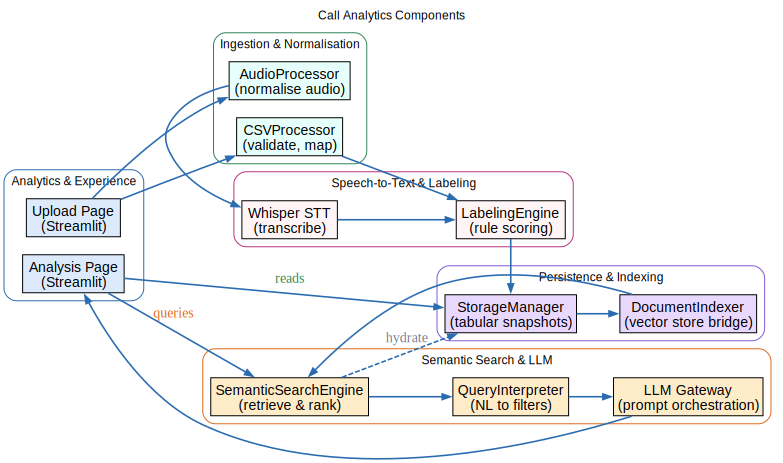
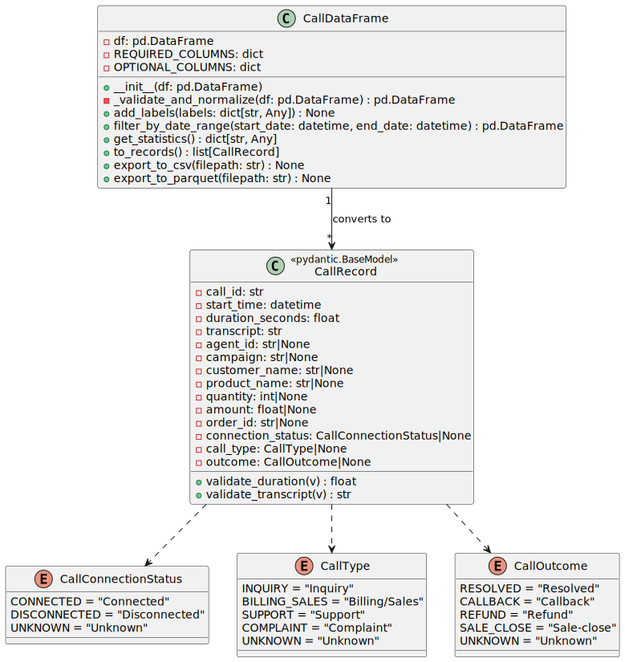
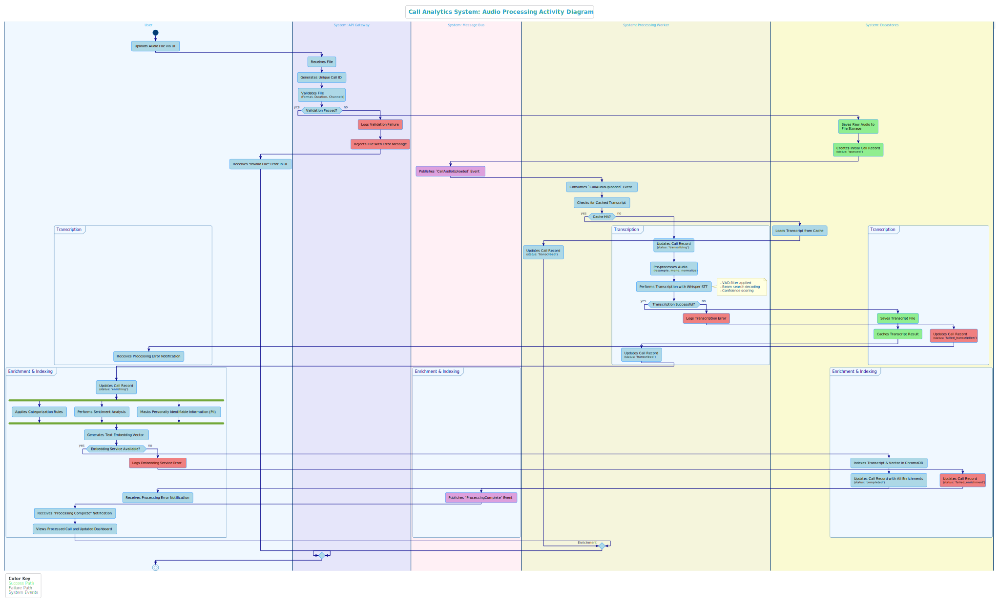

# UML

This page have every UML diagram I rely on when I work on call analytics. I start with the high-level actors, ddives into components and data models, and ends with workflows, AI touchpoints, and UI wiring. If someone needs to understand the system fast, this is where I point them.

## Table of Contents

- [Use Case Diagram](#use-case-diagram)
- [Component Diagram](#component-diagram)
- [Class Diagram](#class-diagram)
- [Activity Diagram](#activity-diagram)
- [Workflow Diagram](#workflow-diagram)
- [LLM Interface Diagram](#llm-interface-diagram)
- [Embeddings Diagram](#embeddings-diagram)
- [Whisper STT Diagram](#whisper-stt-diagram)
- [UI Components Diagram](#ui-components-diagram)

## Use Case Diagram

I use this view to remind myself who triggers the system. It keeps the call operators, analysts, and reporting tools front and center so I never lose track of the core outcomes we promise.

## Component Diagram

This diagram shows how I separate the ingestion pipeline, analytics core, storage, and dashboards. When I plan a change I check the interfaces here to avoid breaking cross-component contracts.

## Class Diagram

These classes map to the entities I persist: calls, transcripts, metrics, aggregates. Seeing relationships and key fields on one canvas helps me shape migrations and DTOs without guesswork.

## Activity Diagram

This flow walks me through a single call lifecycle. I follow it to confirm we capture audio, transcribe, enrich with sentiment/topics, and publish insights in the right order.

## Workflow Diagram

I lean on this when I explain the wider process. It shows where automation ends and human review begins, which is critical when I sync with stakeholders.

## LLM Interface Diagram

Here I track how I orchestrate prompts, guardrails, and responses. It keeps my integration with the LLM deterministic and easy to observe.

## Embeddings Diagram

This helps me tune semantic search. It outlines where I generate vectors, store them, and execute similarity queries so I can debug relevance quickly.

## Whisper STT Diagram

I use this to follow the speech-to-text path. Each stage from audio preprocessing to decoding—stays visible, which is handy when I optimize latency.

## UI Components Diagram

This layout reminds me how the client renders insight. I can see which components fetch data, which ones own state, and how we compose the view layer.