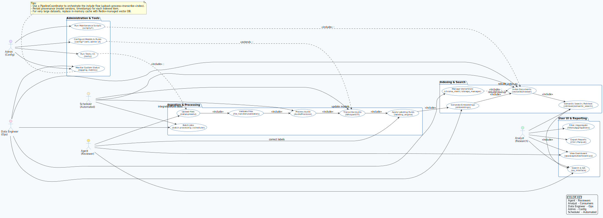
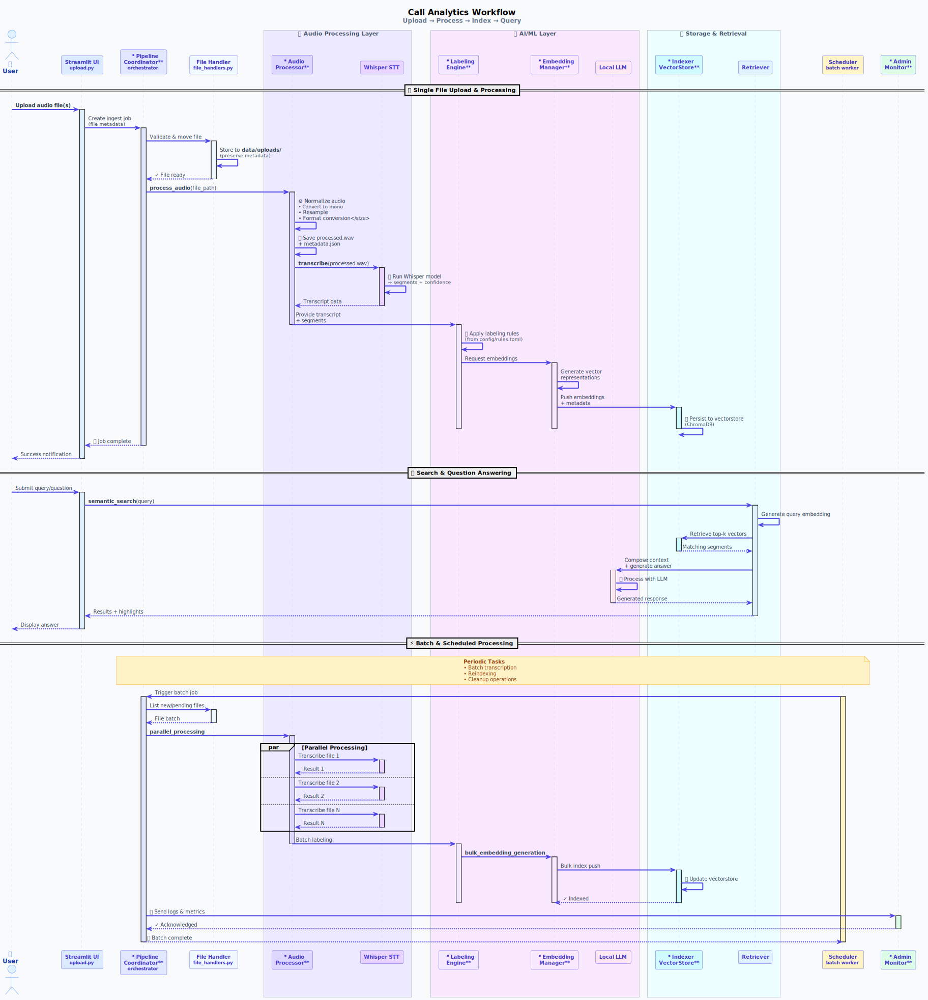
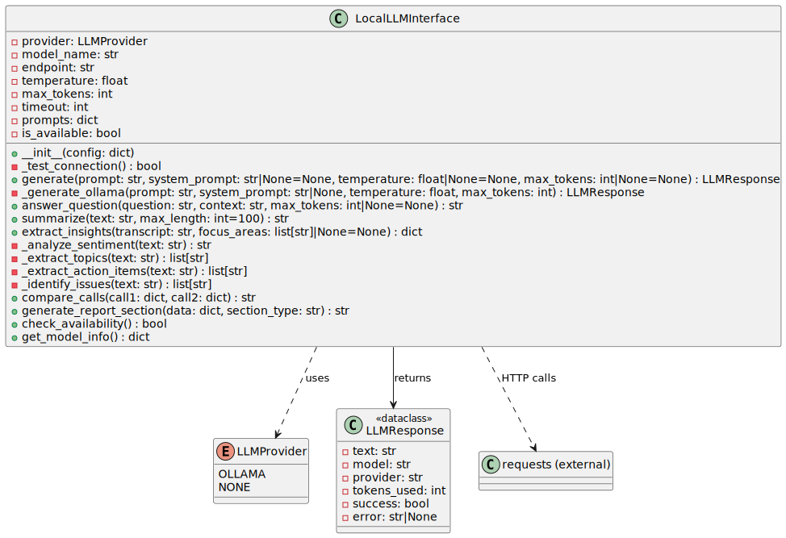
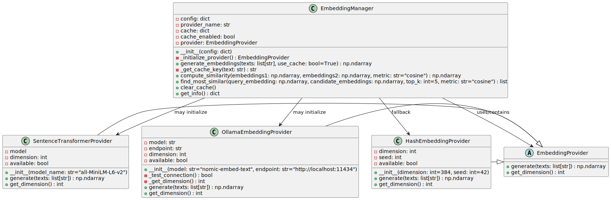
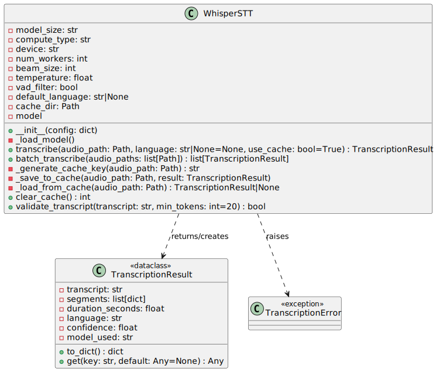
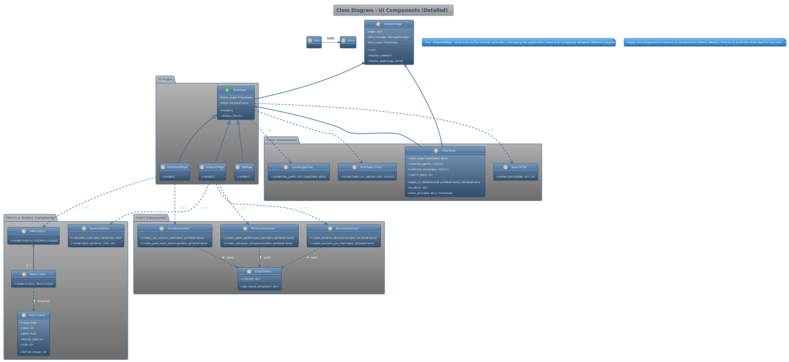

# UML

This page collects the UML diagrams I use for the call analytics system. They move from high-level actors down to detailed flows, AI touchpoints, and UI wiring so the whole lifecycle stays clear.

## Table of Contents

- [Use Case Diagram](#use-case-diagram)
- [Component Diagram](#component-diagram)
- [Class Diagram](#class-diagram)
- [Activity Diagram](#activity-diagram)
- [Workflow Diagram](#workflow-diagram)
- [LLM Interface Diagram](#llm-interface-diagram)
- [Embeddings Diagram](#embeddings-diagram)
- [Whisper STT Diagram](#whisper-stt-diagram)
- [UI Components Diagram](#ui-components-diagram)

## Use Case Diagram



- Call Operator starts call capture and pushes audio into the platform.
- Call Analytics Platform records the session and exposes insights.
- Analyst reviews transcripts, tags issues, and confirms outcomes.
- Reporting Tool pulls metrics and summaries for downstream dashboards.

## Component Diagram

```{mermaid}
flowchart LR
    subgraph UI["Analytics & Experience"]
        Upload["Upload Page"]
        Analysis["Analysis Page"]
    end

    subgraph Ingestion["Ingestion & Normalisation"]
        CSV["CSVProcessor"]
        Audio["AudioProcessor"]
    end

    subgraph STT["Speech-to-Text & Labeling"]
        Whisper["Whisper STT"]
        Labeler["LabelingEngine"]
    end

    subgraph Persistence["Persistence & Indexing"]
        Storage["StorageManager"]
        Indexer["DocumentIndexer"]
    end

    subgraph Search["Semantic Search & LLM"]
        SearchEngine["SemanticSearchEngine"]
        Interpreter["QueryInterpreter"]
        LLM["LLM Gateway"]
    end

    Upload --> CSV
    Upload --> Audio
    Audio --> Whisper
    Whisper --> Labeler
    CSV --> Labeler
    Labeler --> Storage
    Storage --> Indexer
    Indexer --> SearchEngine
    Analysis --> Storage
    Analysis --> SearchEngine
    SearchEngine --> Interpreter
    Interpreter --> LLM
    LLM --> Analysis
    SearchEngine -.-> Storage
```

- I send uploads through `CSVProcessor` and `AudioProcessor` so the raw files get normalised before anything else.
- I pipe audio into `Whisper STT` and then into `LabelingEngine` so transcripts and labels stay together.
- I store the enriched `CallRecord` with `StorageManager` and push vectors through `DocumentIndexer` for search.
- I let `SemanticSearchEngine` and `QueryInterpreter` feed the analysis page (and the LLM gateway) so queries land on the right calls.

## Class Diagram

```{mermaid}
classDiagram
    class CallRecord {
        +str call_id
        +datetime start_time
        +float duration_seconds
        +TranscriptionResult transcription
        +LabelingResult labels
        +list~MetricPoint~ metrics
    }

    class TranscriptionResult {
        +str transcript
        +str language
        +float confidence
    }

    class LLMResponse {
        +str answer
        +float confidence
        +dict metadata
    }

    class LabelingResult {
        +CallOutcome outcome
        +CallType call_type
        +CallConnectionStatus connection_status
    }

    class MetricPoint {
        +str name
        +float value
        +datetime captured_at
    }

    class LabelingEngine {
        +apply_rules(call: CallRecord) LabelingResult
        +score(call: CallRecord) float
    }

    class StorageManager {
        +save(call: CallRecord)
        +load(call_id: str) CallRecord
        +snapshot() list~CallRecord~
    }

    class DocumentIndexer {
        +index(call: CallRecord)
        +search(query: str) list~DocumentHit~
    }

    class SemanticSearchEngine {
        +retrieve(query: str) list~CallRecord~
        +rank(results: list~DocumentHit~) list~CallRecord~
    }

    CallRecord --> TranscriptionResult : embeds
    CallRecord --> LabelingResult : derives
    CallRecord --> MetricPoint : aggregates
    LabelingEngine --> LabelingResult : creates
    LabelingEngine --> CallRecord : enriches
    StorageManager --> CallRecord : persists
    DocumentIndexer --> CallRecord : indexes
    DocumentIndexer --> SemanticSearchEngine : serves
    SemanticSearchEngine --> LLMResponse : packages context
```

- `CallRecord` as the aggregate so transcripts, labels, and metrics stay together.
- `TranscriptionResult` and `LLMResponse` as value objects to keep the language work predictable.
- `LabelingEngine`, `StorageManager`, and `DocumentIndexer` as services for rules, storage, and search.
- `SemanticSearchEngine` connects to `LLMResponse` to show how query context flows into the LLM.

## Activity Diagram

<div align="center">

```{mermaid}
stateDiagram-v2
    [*] --> CaptureUpload
    CaptureUpload: Capture upload and metadata
    CaptureUpload --> CleanCSV: Normalize tabular data
    CaptureUpload --> PrepAudio: Prepare audio stream
    CleanCSV --> LabelCall: Provide call facts
    PrepAudio --> Whisper: Transcribe via Whisper STT
    Whisper --> LabelCall: Attach transcript
    LabelCall: Apply rules with LabelingEngine
    LabelCall --> Persist: Store CallRecord with StorageManager
    Persist --> Embed: Publish embeddings with DocumentIndexer
    Embed --> Search: Feed SemanticSearchEngine
    Search --> InsightView: Surface insights on analysis page
    Search --> LLMHub: Provide context for LLM gateway
    LLMHub --> InsightView: Return summaries
    InsightView --> AnalystFeedback: Collect analyst feedback and tags
    AnalystFeedback --> TuneRules: Adjust rules or metrics
    TuneRules --> LabelCall: Feed improved rules
    InsightView --> [*]
```

</div>

- Capture the upload, normalise the CSV fields, and prep the audio together.
- Transcribe the call with Whisper and apply the labeling rules before persisting the `CallRecord`.
- Publish embeddings so semantic search and the LLM gateway can reuse the same context.
- Surface insights in the analysis view and feed analyst feedback into the next rules pass.


## Workflow Diagram



- Automate ingestion, transcription, and first-pass analytics.
- Route flagged calls to analysts for manual review.
- Close the loop with feedback into coaching and reporting.

## LLM Interface Diagram



- Construct prompts with context from the transcript, metrics, and policies.
- Apply guardrails that enforce format and compliance instructions.
- Send prompts to the LLM and capture responses with confidence scores.
- Log requests, responses, and feedback for monitoring.

## Embeddings Diagram



- Generate embeddings for transcripts, snippets, and knowledge articles.
- Store vectors alongside metadata in the embeddings index.
- Run similarity queries to surface related calls or articles.
- Feed matches into search results, coaching tips, and automation.

## Whisper STT Diagram



- Preprocess audio with normalization, chunking, and noise reduction.
- Encode audio frames and decode text with Whisper.
- Post-process the transcript for punctuation, diarization, and timestamps.
- Return text to the analytics pipeline with status updates.

## UI Components Diagram



- Dashboard shell loads user context and shared filters.
- Insights panel fetches metrics, highlights, and alerts.
- Transcript viewer streams text, speaker labels, and annotations.
- Coaching actions panel captures notes, tasks, and follow-ups.
