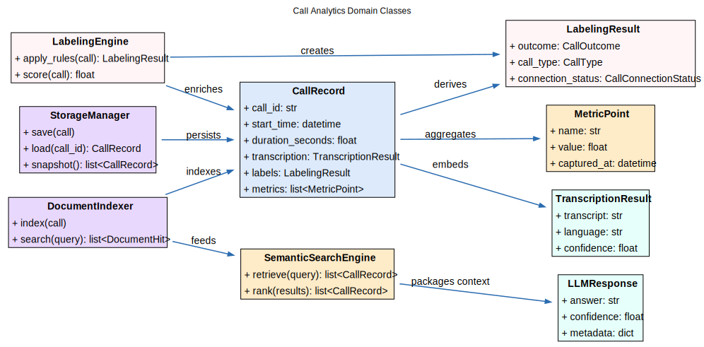
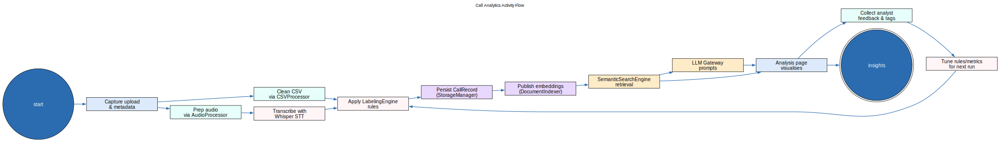
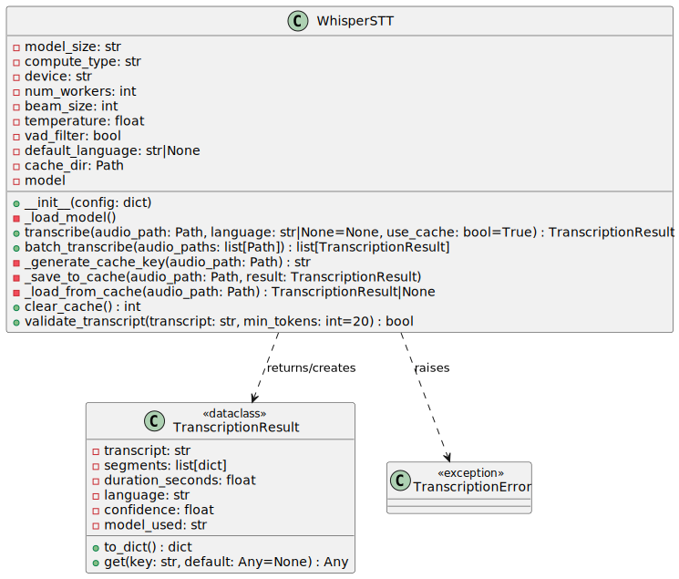

# UML

This page collects the UML diagrams I use for the call analytics system. They move from high-level actors down to detailed flows, AI touchpoints, and UI wiring so the whole lifecycle stays clear.

## Table of Contents

- [Use Case Diagram](#use-case-diagram)
- [Component Diagram](#component-diagram)
- [Class Diagram](#class-diagram)
- [Activity Diagram](#activity-diagram)
- [Workflow Diagram](#workflow-diagram)
- [LLM Interface Diagram](#llm-interface-diagram)
- [Embeddings Diagram](#embeddings-diagram)
- [Whisper STT Diagram](#whisper-stt-diagram)
- [UI Components Diagram](#ui-components-diagram)

## Use Case Diagram

- Call Operator starts call capture and pushes audio into the platform.
- Call Analytics Platform records the session and exposes insights.
- Analyst reviews transcripts, tags issues, and confirms outcomes.
- Reporting Tool pulls metrics and summaries for downstream dashboards.

## Component Diagram

- Ingestion Layer accepts raw audio, call metadata, and agent notes.
- Analytics Core runs transcription, sentiment, topic extraction, and scoring.
- Storage Services hold raw artifacts, processed features, and aggregates.
- Visualization and API Layer serves dashboards, exports, and webhooks.

## Class Diagram

- `Call` stores caller, agent, timestamps, and linkage to transcripts.
- `Transcript` keeps the text, speaker turns, and sentiment tags.
- `Metric` captures computed KPIs per call or time window.
- `Aggregate` tracks rollups for teams, campaigns, and time periods.

## Activity Diagram

- Receive inbound or outbound call audio and log metadata.
- Transcribe the call and align speaker turns.
- Enrich the transcript with sentiment, topics, and compliance checks.
- Publish insights to the dashboard and alerting channels.

## Workflow Diagram

- Automate ingestion, transcription, and first-pass analytics.
- Route flagged calls to analysts for manual review.
- Close the loop with feedback into coaching and reporting.

## LLM Interface Diagram

- Construct prompts with context from the transcript, metrics, and policies.
- Apply guardrails that enforce format and compliance instructions.
- Send prompts to the LLM and capture responses with confidence scores.
- Log requests, responses, and feedback for monitoring.

## Embeddings Diagram

- Generate embeddings for transcripts, snippets, and knowledge articles.
- Store vectors alongside metadata in the embeddings index.
- Run similarity queries to surface related calls or articles.
- Feed matches into search results, coaching tips, and automation.

## Whisper STT Diagram

- Preprocess audio with normalization, chunking, and noise reduction.
- Encode audio frames and decode text with Whisper.
- Post-process the transcript for punctuation, diarization, and timestamps.
- Return text to the analytics pipeline with status updates.

## UI Components Diagram

- Dashboard shell loads user context and shared filters.
- Insights panel fetches metrics, highlights, and alerts.
- Transcript viewer streams text, speaker labels, and annotations.
- Coaching actions panel captures notes, tasks, and follow-ups.
